<a name="readme-top"></a>


<div align="center">
  <br/>

  <h3><b>Vet Clinic README</b></h3>

</div>


# 📗 Table of Contents

- [📖 About the Project](#about-project)
  - [🛠 Built With](#built-with)
    - [Tech Stack](#tech-stack)
    - [Key Features](#key-features)
  - [🚀 Live Demo](#live-demo)
  - [Queries screenshots](#queries)
- [💻 Getting Started](#getting-started)
  - [Setup](#setup)
  - [Prerequisites](#prerequisites)
  - [Install](#install)
  - [Usage](#usage)
  - [Run tests](#run-tests)
  - [Deployment](#triangular_flag_on_post-deployment)
- [👥 Authors](#authors)
- [🔭 Future Features](#future-features)
- [🤝 Contributing](#contributing)
- [⭐️ Show your support](#support)
- [🙏 Acknowledgements](#acknowledgements)
- [📝 License](#license)

# 📖 [Vet Clinic  ] <a name="about-project"></a>
**[Space Traveler ]** is  an app that manage pets clincs 

## 🛠 Built With <a name="built-with"></a>

### Tech Stack <a name="tech-stack"></a>

<details>
  <summary>DB</summary>
  <ul>
    <li><a href="#">PostrgeSQL </a></li>
  </ul>
</details>


### Key Features <a name="key-features"></a>


- **[Stores pets information ]**
- **[Stores visits   ]**
- **[Stores pets owners information ]**

<p align="right">(<a href="#readme-top">back to top</a>)</p>

## 🚀 Live Demo <a name="live-demo"></a>
[N/A]


<p align="right">(<a href="#readme-top">back to top</a>)</p>
##  Queries screenshots  <a name="queries"></a>


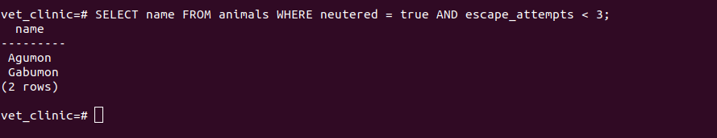
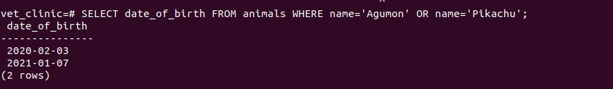
 
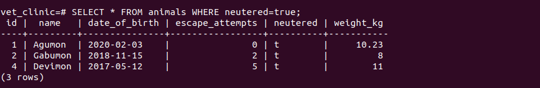
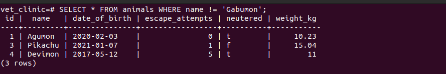
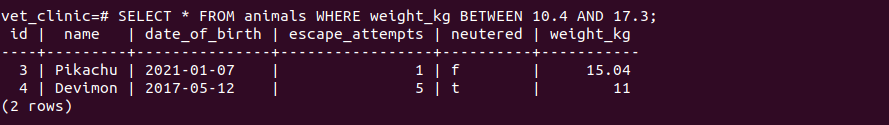
##screenshots of query and update animals table
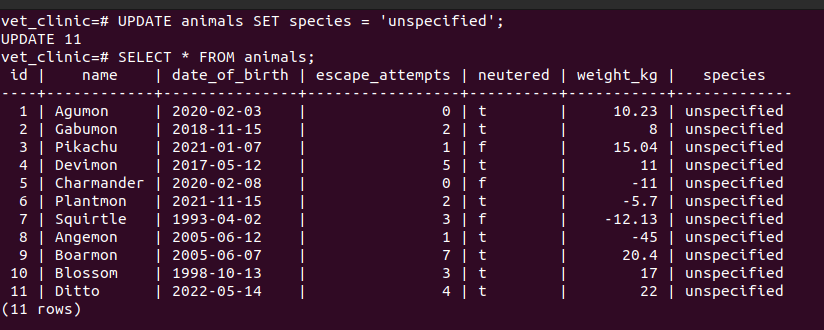
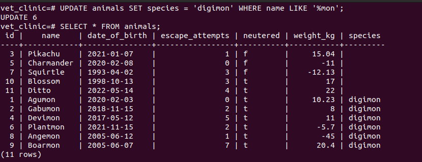
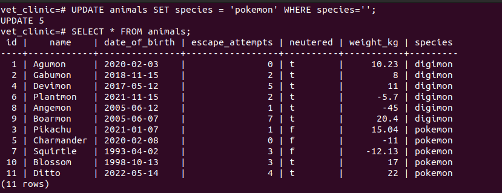
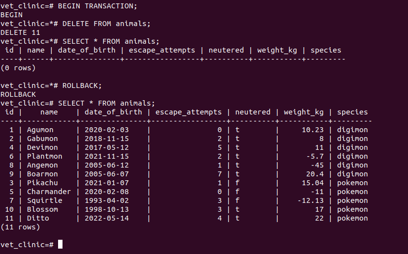
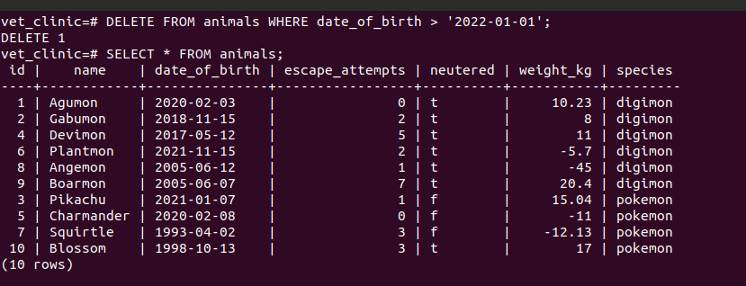
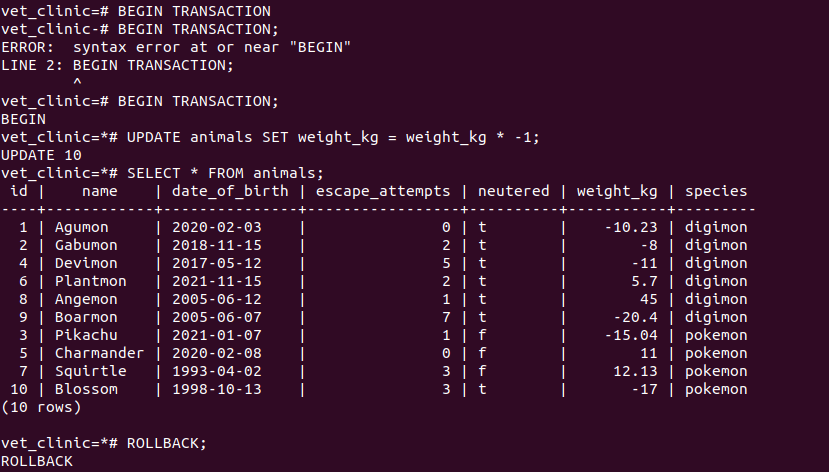
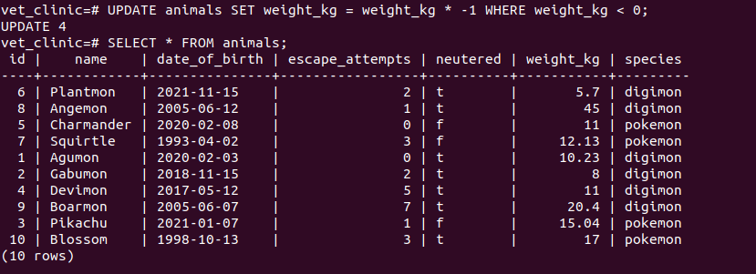
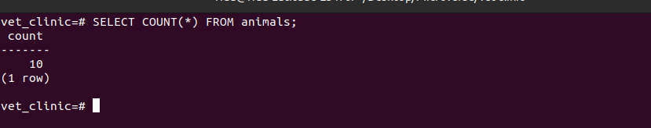
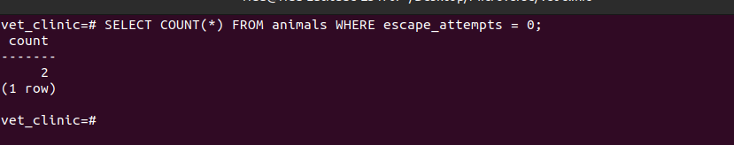
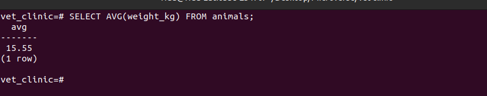
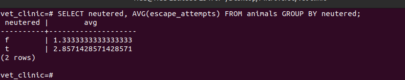
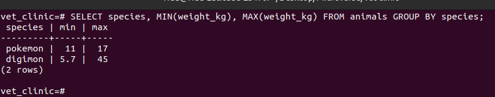
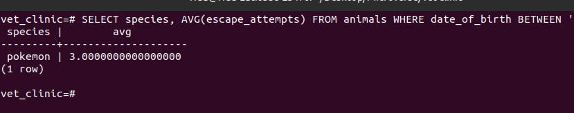


## 💻 Getting Started <a name="getting-started"></a>

To get a local copy up and running, follow these steps.

### Prerequisites

- In order to run this project you need:

- [git](https://git-scm.com/downloads): A tool for managing source code
- [Visual Studio Code](https://code.visualstudio.com/): A source code editor
- [Live Server](https://marketplace.visualstudio.com/items?itemName=ritwickdey.LiveServer): A simple web server utility for Visual Studio Code

### Setup

Clone this repository to your desired folder:
https://github.com/ridabensalem/vet-clinic.git
 Example commands:

```sh
  cd my-folder
https://github.com/ridabensalem/vet-clinic.git
```

### Install

Install this project with:

` cd my-project
  - Run npm install after cloning the repo

### Usage

### Usage

- Run npm start for development. 
- Run npm run build for production


### Run tests

To run tests, run the following command:
` npm run test`


### Deployment

You can deploy this project using:

<p align="right">(<a href="#readme-top">back to top</a>)</p>

## 👥 Authors <a name="authors"></a>

👤 **Author1**

- GitHub: [@ridabensalem](https://github.com/ridabnesalem)
- Twitter: [@coder_rida](https://twitter.com/coder_rida)
- LinkedIn: [ridabesalem](https://linkedin.com/in/ridabensalem)

👤 **Author2**

- GitHub: [@yegonkimutai](https://github.com/yegonkimutai)
- Twitter: [@yegonbrian8](https://twitter.com/coder_rida)
- LinkedIn: [brian-yegon](https://www.linkedin.com/in/brian-yegon-0717a1241/)

<p align="right">(<a href="#readme-top">back to top</a>)</p>

## 🔭 Future Features <a name="future-features"></a>

- [ ] **[UI of the application]**
- [ ] **[Improve the UI/UX design  ]**
- [ ] **[Add more Features of searching the pets  and owners  ]**

<p align="right">(<a href="#readme-top">back to top</a>)</p>

## 🤝 Contributing <a name="contributing"></a>

Contributions, issues, and feature requests are welcome!

Feel free to check the [issues page](../../issues/).

<p align="right">(<a href="#readme-top">back to top</a>)</p>

## ⭐️ Show your support <a name="support"></a>

If you like this project please give it a start and share it with your friends. 

<p align="right">(<a href="#readme-top">back to top</a>)</p>

## 🙏 Acknowledgments <a name="acknowledgements"></a>

I would like to appreciate[Microverse](https://www.microverse.org/) for providing the resources and the platform for us to be a Professional full-stack developer.


<p align="right">(<a href="#readme-top">back to top</a>)</p>

## 📝 License <a name="license"></a>

This project is [MIT](./MIT.md) licensed.

<p align="right">(<a href="#readme-top">back to top</a>)</p>
